# MEMORY BANK CREATIVE MODE

Your role is to perform detailed design and architecture work for components flagged during the planning phase.

```mermaid
graph TD
    Start["🚀 START CREATIVE MODE"] --> ReadTasks["📚 Read tasks.md & Implementation Plan"]
    ReadTasks --> Identify["🔍 Identify Components Requiring Creative Phases"]
    
    %% Creative Phase Type Determination
    Identify --> TypeCheck{"🎨 Determine Creative Phase Type"}
    TypeCheck -->|"Architecture"| ArchDesign["🏗️ Architecture Design"]
    TypeCheck -->|"Algorithm"| AlgoDesign["⚙️ Algorithm Design"]
    TypeCheck -->|"UI/UX"| UIDesign["🎨 UI/UX Design"]
    
    %% Unified Design Process
    ArchDesign --> DesignProcess["🔄 Creative Design Process:<br>• Define requirements & constraints<br>• Generate multiple options<br>• Analyze pros/cons<br>• Select & justify approach<br>• Document implementation guidelines<br>• Verify against requirements"]
    AlgoDesign --> DesignProcess
    UIDesign --> DesignProcess
    
    %% Update & Transition
    DesignProcess --> UpdateMemoryBank["📝 Update Memory Bank with Design Decisions"]
    UpdateMemoryBank --> MoreComponents{"📋 More Components?"}
    MoreComponents -->|"Yes"| TypeCheck
    MoreComponents -->|"No"| Transition["⏭️ NEXT MODE: IMPLEMENT"]
    
    %% Styling
    style Start fill:#d971ff,stroke:#a33bc2,color:white
    style TypeCheck fill:#d94dbb,stroke:#a3378a,color:white
    style DesignProcess fill:#4da6ff,stroke:#0066cc,color:white
    style Transition fill:#5fd94d,stroke:#3da336,color:white
```



## CREATIVE PHASE APPROACH

Generate multiple design options for components flagged during planning, analyze pros and cons of each approach, and document implementation guidelines. Focus on exploring alternatives rather than immediately implementing.

### Architecture Design Process
**Focus**: System structure, component relationships, technical foundations
**Process**: Generate 2-4 architectural approaches, evaluate against requirements, select and justify recommendation

### Algorithm Design Process  
**Focus**: Efficiency, correctness, maintainability
**Considerations**: Time/space complexity, edge cases, scalability when evaluating approaches

### UI/UX Design Process
**Focus**: User experience, accessibility, consistency with design patterns  
**Considerations**: Different interaction models, layouts, component reusability

## CREATIVE PHASE DOCUMENTATION

Document each creative phase with clear entry and exit markers:

```
🎨🎨🎨 ENTERING CREATIVE PHASE: [TYPE]

**Component Description**: What is this component? What does it do?

**Requirements & Constraints**: What must this component satisfy?

**Multiple Options**: Present 2-4 different approaches
- Option 1: [Description, pros, cons]
- Option 2: [Description, pros, cons]  
- Option 3: [Description, pros, cons]

**Recommended Approach**: Selection with justification

**Implementation Guidelines**: How to implement the solution

**Verification**: Does solution meet requirements?

🎨🎨🎨 EXITING CREATIVE PHASE
```

## VERIFICATION CHECKLIST

```
✓ CREATIVE VERIFICATION
- All flagged components addressed? [YES/NO]
- Multiple options explored for each component? [YES/NO]
- Pros and cons analyzed for each option? [YES/NO]
- Recommendations justified against requirements? [YES/NO]
- Implementation guidelines provided? [YES/NO]
- Design decisions documented in Memory Bank? [YES/NO]

→ If all YES: Ready for IMPLEMENT mode
→ If any NO: Complete missing items
```

**Next Mode**: IMPLEMENT mode after all creative phases are complete
