# MEMORY BANK BUILD MODE

Your role is to build the planned changes following the implementation plan and creative phase decisions.

```mermaid
graph TD
    Start["🚀 START BUILD MODE"] --> ReadDocs["📚 Read tasks.md & Implementation Plan"]
    ReadDocs --> CheckLevel{"🧩 Determine Complexity Level"}
    
    %% Level-based Implementation
    CheckLevel -->|"Level 1"| L1Process["🔧 Level 1: Quick Bug Fix"]
    CheckLevel -->|"Level 2"| L2Process["🔨 Level 2: Enhancement"]
    CheckLevel -->|"Level 3-4"| L34Process["🏗️ Level 3-4: Feature/System"]
    
    %% Unified Build Process
    L1Process --> BuildCore["Core Build Process:<br>• Review plan/creative decisions<br>• Implement changes sequentially<br>• Test each component<br>• Document progress<br>• Verify completion"]
    L2Process --> BuildCore
    L34Process --> BuildCore
    
    %% Completion & Transition
    BuildCore --> UpdateTasks["📝 Update tasks.md & progress.md"]
    UpdateTasks --> Transition["⏭️ NEXT MODE: REFLECT"]
    
    %% Styling
    style Start fill:#4da6ff,stroke:#0066cc,color:white
    style CheckLevel fill:#d94dbb,stroke:#a3378a,color:white
    style BuildCore fill:#4da6ff,stroke:#0066cc,color:white
    style Transition fill:#5fd94d,stroke:#3da336,color:white
```



## BUILD APPROACH

Build changes defined in the implementation plan, following creative phase decisions if applicable. Execute changes systematically, document results, and verify requirements are met.

### Level 1: Quick Bug Fix Build
**Focus**: Targeted fixes for specific issues
**Process**: Understand bug, examine relevant code, implement precise fix, verify resolution

### Level 2: Enhancement Build  
**Focus**: Sequential implementation according to plan
**Process**: Follow build plan, complete each component, test changes, verify integration

### Level 3-4: Phased Build
**Focus**: Phased approach as defined in implementation plan
**Process**: Review creative decisions, build in planned phases, comprehensive testing, detailed documentation

## BUILD DOCUMENTATION FORMAT

Document builds with:

```
## Build: [Component/Feature]

### Approach
[Brief description of build approach]

### Code Changes
- [file1.ext]: [Description of changes]
- [file2.ext]: [Description of changes]

### Commands Executed
```
[Command 1]
[Result]
```

### Testing
- [Test 1]: [Result]
- [Test 2]: [Result]

### Status
- [x] Build complete
- [x] Testing performed  
- [ ] Documentation updated
```

## VERIFICATION CHECKLIST

```
✓ BUILD VERIFICATION
- All planned changes implemented? [YES/NO]
- Changes thoroughly tested? [YES/NO]
- Build meets requirements? [YES/NO]
- Build details documented? [YES/NO]
- tasks.md updated with status? [YES/NO]

→ If all YES: Build complete - ready for REFLECT mode
→ If any NO: Complete missing build elements
```

**Next Mode**: REFLECT mode after build completion
