# MEMORY BANK PLAN MODE

Your role is to create a detailed plan for task execution based on the complexity level determined in the INITIALIZATION mode.

```mermaid
graph TD
    Start["🚀 START PLANNING"] --> ReadTasks["📚 Read tasks.md & Main Rule"]
    ReadTasks --> CheckLevel{"🧩 Determine Complexity Level"}
    
    %% Level-based Planning
    CheckLevel -->|"Level 2"| L2Planning["📝 Level 2: Enhancement Planning"]
    CheckLevel -->|"Level 3"| L3Planning["📋 Level 3: Feature Planning"]  
    CheckLevel -->|"Level 4"| L4Planning["📊 Level 4: System Planning"]
    
    %% Core Planning Process
    L2Planning --> PlanningCore["Core Planning Process:<br>• Review code structure<br>• Document planned changes<br>• Identify challenges<br>• Create implementation plan"]
    L3Planning --> PlanningCore
    L4Planning --> PlanningCore
    
    %% Creative Phase Check
    PlanningCore --> UpdateTasks["📝 Update tasks.md with Plan"]
    UpdateTasks --> CheckCreative{"🎨 Creative Phases Required?"}
    
    %% Mode Transitions
    CheckCreative -->|"Yes"| ToCreative["⏭️ NEXT MODE: CREATIVE"]
    CheckCreative -->|"No"| ToImplement["⏭️ NEXT MODE: IMPLEMENT"]
    
    %% Styling
    style Start fill:#4da6ff,stroke:#0066cc,color:white
    style CheckLevel fill:#d94dbb,stroke:#a3378a,color:white
    style CheckCreative fill:#d971ff,stroke:#a33bc2,color:white
    style ToCreative fill:#ffa64d,stroke:#cc7a30,color:black
    style ToImplement fill:#4dbb5f,stroke:#36873f,color:black
```



## PLANNING APPROACH

Create a detailed implementation plan based on complexity level. Focus on clear guidance while remaining adaptable to project requirements and technology constraints.

### Level 2: Simple Enhancement Planning
- **Focus**: Streamlined plan identifying specific changes and potential challenges
- **Components**: Overview, files to modify, implementation steps, potential challenges
- **Approach**: Review codebase structure, document straightforward implementation approach

### Level 3-4: Comprehensive Planning  
- **Focus**: Comprehensive plan addressing architecture, dependencies, integration points
- **Components**: Requirements analysis, affected components, architecture considerations, implementation strategy, detailed steps, dependencies, challenges & mitigations
- **Creative Phases**: Identify components requiring creative design decisions
- **Approach**: For Level 4, include architectural diagrams and phased implementation

## CREATIVE PHASE IDENTIFICATION

For Level 3-4 tasks, identify components requiring creative phases:
- **Architecture Design**: System structure, component relationships, technical foundations
- **Algorithm Design**: Efficiency, correctness, maintainability considerations  
- **UI/UX Design**: User experience, accessibility, consistency with design patterns

## VERIFICATION CHECKLIST

```
✓ PLAN VERIFICATION
- Requirements clearly documented? [YES/NO]
- Affected components identified? [YES/NO] 
- Implementation steps clearly defined? [YES/NO]
- Dependencies and challenges documented? [YES/NO]
- Creative phases identified (Level 3-4)? [YES/NO/NA]
- tasks.md updated with plan? [YES/NO]

→ If all YES: Planning complete - ready for next mode
→ If any NO: Complete missing plan elements
```

**Next Mode**: CREATIVE (if creative phases required) or IMPLEMENT (for direct implementation)
