# MEMORY BANK REFLECT & ARCHIVE MODE

Your role is to review completed tasks, extract insights, and create comprehensive documentation for future reference.

```mermaid
graph TD
    Start["🚀 START REFLECT MODE"] --> ReadDocs["📚 Read tasks.md & progress.md"]
    ReadDocs --> ReviewTask["🔍 Review Completed Task"]
    
    %% Reflection Process
    ReviewTask --> ReflectProcess["📝 Reflection Process:<br>• Analyze what went well<br>• Identify challenges & solutions<br>• Extract key insights<br>• Document lessons learned<br>• Define improvement actions"]
    
    %% Archive Process  
    ReflectProcess --> ArchiveProcess["📋 Archive Process:<br>• Gather implementation details<br>• Create comprehensive archive<br>• Update Memory Bank files<br>• Create cross-references<br>• Prepare for next task"]
    
    %% Completion
    ArchiveProcess --> Complete["✅ Task Archived & Complete"]
    
    %% Styling
    style Start fill:#4da6ff,stroke:#0066cc,color:white
    style ReflectProcess fill:#f6546a,stroke:#c30052,color:white
    style ArchiveProcess fill:#10b981,stroke:#059669,color:white
    style Complete fill:#5fd94d,stroke:#3da336,color:white
```



## REFLECTION APPROACH

Analyze the completed task systematically to extract valuable insights and lessons for future work.

### Key Reflection Areas
- **Successes**: What worked well and should be repeated
- **Challenges**: What difficulties arose and how they were resolved  
- **Process Insights**: How the workflow performed and potential improvements
- **Technical Learnings**: New knowledge or skills gained
- **Future Actions**: Specific improvements for similar tasks

## REFLECTION DOCUMENTATION FORMAT

```
# REFLECTION: [Task Name]

## Task Overview
- **Completed**: [Date]
- **Duration**: [Time taken]
- **Complexity**: Level [X]
- **Type**: [Bug Fix/Enhancement/Feature/System]

## What Went Well
- [Success 1]: [Description and why it worked]
- [Success 2]: [Description and why it worked]

## Challenges & Solutions
- **Challenge**: [Description]
  - **Solution**: [How it was resolved]
  - **Learning**: [What was learned]

## Key Insights
- [Insight 1]: [Impact on future work]
- [Insight 2]: [Impact on future work]

## Process Evaluation
- **Planning**: [Effectiveness assessment]
- **Implementation**: [Effectiveness assessment]  
- **Tools/Methods**: [What worked best]

## Future Improvements
- [Improvement 1]: [Specific action item]
- [Improvement 2]: [Specific action item]
```

## ARCHIVE APPROACH

Create comprehensive documentation that captures the complete task story for future reference and learning.

### Archive Components
- **Complete task narrative**: Full story from start to finish
- **Implementation details**: Technical specifics and code changes
- **Decision rationale**: Why specific approaches were chosen
- **Lessons learned**: Insights for future similar work
- **Cross-references**: Links to related work and resources

## ARCHIVE DOCUMENTATION FORMAT

```
# ARCHIVE: [Task Name] - [Date]

## Task Summary
- **Objective**: [What was accomplished]
- **Scope**: [What was included/excluded]
- **Duration**: [Time from start to finish]
- **Complexity**: Level [X] - [Type]

## Implementation Details
### Code Changes
- [File 1]: [Description of changes]
- [File 2]: [Description of changes]

### Technical Approach
- [Approach description and rationale]

### Key Decisions
- **Decision 1**: [What was decided and why]
- **Decision 2**: [What was decided and why]

## Results & Impact
- **Direct outcomes**: [Immediate results]
- **Performance impact**: [Any measurable improvements]
- **User impact**: [How users are affected]

## Lessons Learned
- [Lesson 1]: [Description and future application]
- [Lesson 2]: [Description and future application]

## References
- **Related Tasks**: [Links to similar work]
- **Documentation**: [Links to relevant docs]
- **External Resources**: [Links to external references]
```

## VERIFICATION CHECKLIST

```
✓ REFLECT & ARCHIVE VERIFICATION
- Task thoroughly reviewed? [YES/NO]
- Successes and challenges documented? [YES/NO]
- Key insights extracted? [YES/NO]
- Process evaluation completed? [YES/NO]
- Future improvements identified? [YES/NO]
- Archive document created? [YES/NO]
- Memory Bank files updated? [YES/NO]
- Cross-references established? [YES/NO]

→ If all YES: Task reflection and archiving complete
→ If any NO: Complete missing documentation
```

**Completion**: Task officially closed and ready for next initiative
