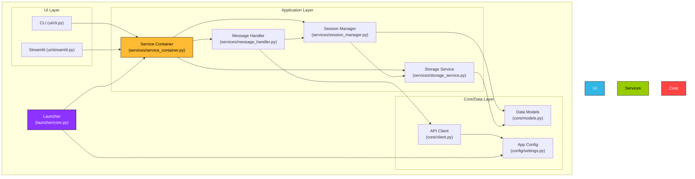

# 🎨 CREATIVE PHASE: Architecture Design

## 1. Problem Statement
The current project structure is cluttered and has several overlapping modules, making it difficult to maintain and extend. Key issues include multiple entry points, duplicated logic in `interfaces` and `services`, and an unorganized UI layer. The goal is to refactor the project into a clean, layered architecture that is modular, scalable, and easy to understand.

## 2. Architecture Decision
A layered architecture with Dependency Injection (via a Service Container) was chosen. This pattern provides a clear separation of concerns, improves testability, and reduces coupling between components.

- **UI Layer**: Handles user interaction (CLI, Streamlit).
- **Application Layer**: Contains the core business logic, managed and served by a central Service Container.
- **Core/Data Layer**: Manages data models, external API communication, and configuration.

## 3. Target Architecture Diagram
This diagram visualizes the relationships and dependencies between the major components of the refactored application.

## 4. Implementation Plan
The implementation will follow the five phases outlined in `memory-bank/tasks.md`. This architecture diagram will serve as the guiding blueprint for all refactoring activities in the `BUILD` phase. 